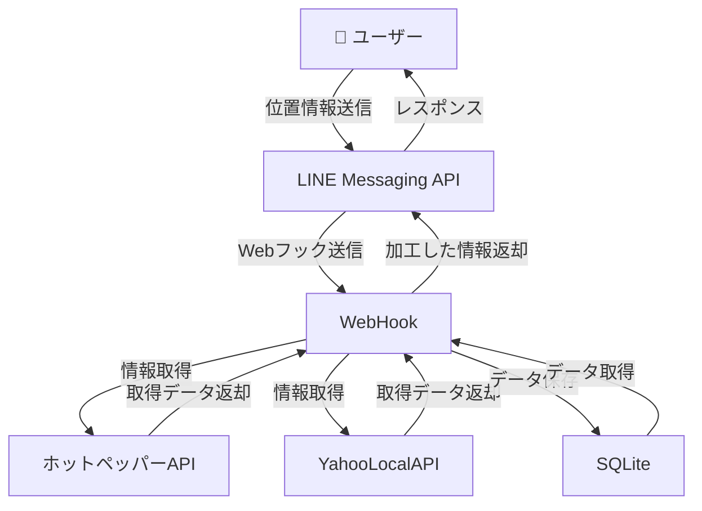

# アーキテクチャ図

```mermaid
graph TD
    User["👤 ユーザー"]
    LineAPI["LINE Messaging API"]
    HotPepper["ホットペッパーAPI"]
    Yahoo["YahooLocalAPI"]
    DB["SQLite"]
    
    User -->|位置情報送信| LineAPI
    LineAPI -->|Webフック送信| WebHook
    WebHook -->|情報取得| HotPepper
    HotPepper -->|取得データ返却| WebHook
    WebHook -->|情報取得| Yahoo
    Yahoo -->|取得データ返却| WebHook
    WebHook -->|データ保存| DB
    DB -->|データ取得| WebHook
    WebHook -->|加工した情報返却| LineAPI
    LineAPI -->|レスポンス| User
```