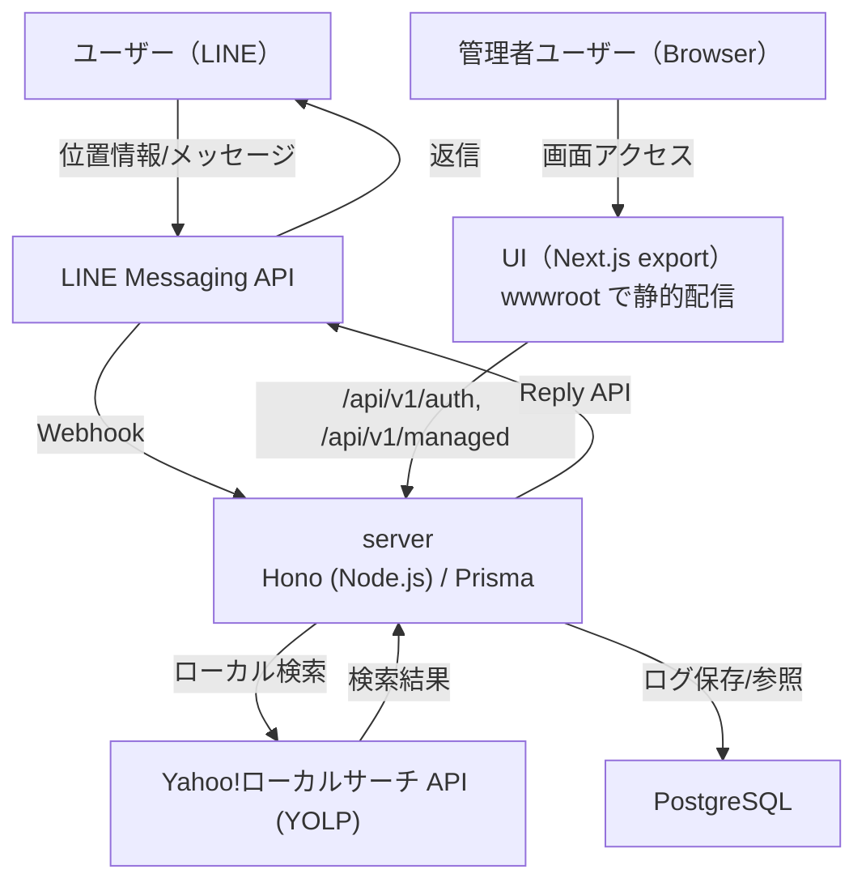
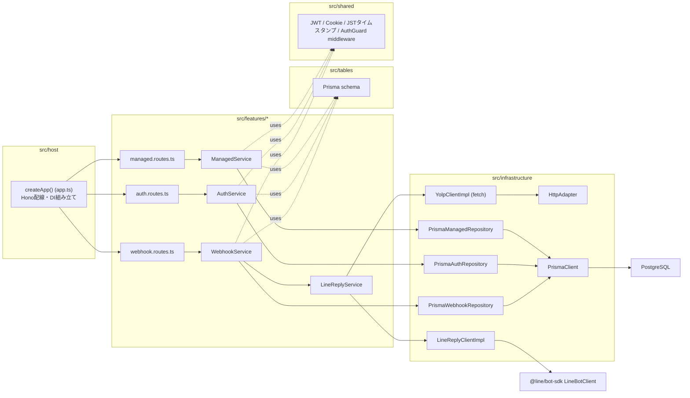
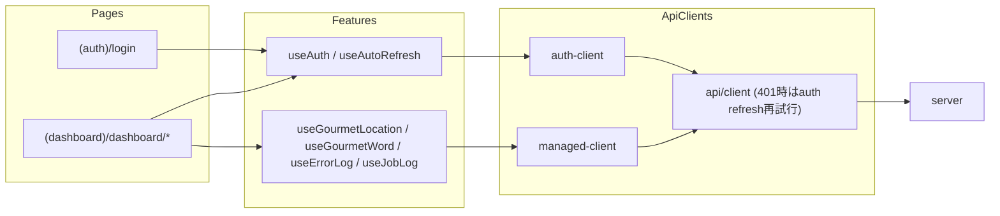
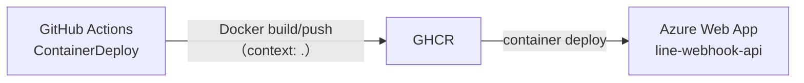

# アーキテクチャ図

## 1. システム全体（Runtime）

## 2. API 内部（Dependency、`server/`）

pnpmの非hoisted node_modules + eslint-plugin-boundariesで、上記の参照方向（Host→Features→Tables/Shared、Infrastructure→Tables/Features/Shared）を物理的・lintレベルの両方で強制している。

## 3. UI 内部（Dependency）

## 4. デプロイ経路（CI/CD）

注記:
- `Dockerfile` は multi-stage build で `web` と `server` をビルドし、`web/out` を server コンテナの `wwwroot` に、`server` 一式（node_modules込み）を同梱します。実行は `tsx` で `src/host/src/main.ts` を直接起動します。
- 認証は `Access Token + Refresh Token` を利用し、`RefreshToken` は DB で管理します。
