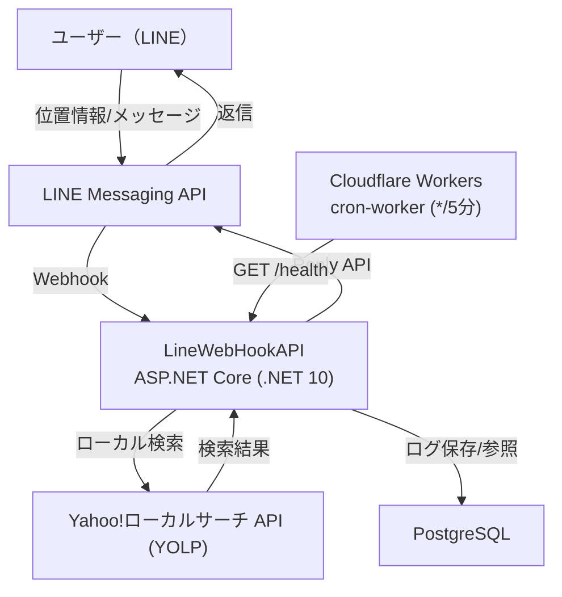
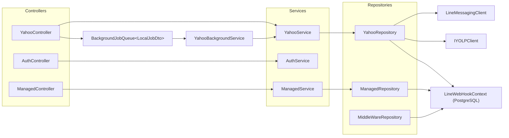
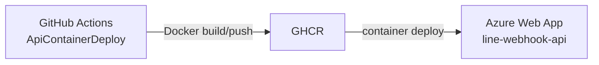

# アーキテクチャ図

## 1. システム全体（Runtime）

```mermaid
graph TD
    User["ユーザー（LINE）"]
    LineAPI["LINE Messaging API"]
    Api["LineWebHookAPI<br/>ASP.NET Core (.NET 10)"]
    Yahoo["Yahoo!ローカルサーチ API (YOLP)"]
    DB["PostgreSQL"]
    Worker["Cloudflare Workers<br/>cron-worker (*/5分)"]

    User -->|位置情報/メッセージ| LineAPI
    LineAPI -->|Webhook| Api
    Api -->|ローカル検索| Yahoo
    Yahoo -->|検索結果| Api
    Api -->|ログ保存/参照| DB
    Api -->|Reply API| LineAPI
    LineAPI -->|返信| User
    Worker -->|GET /health| Api
```

## 2. API 内部（Dependency）

```mermaid
graph LR
    subgraph Controllers
      YahooController["YahooController"]
      AuthController["AuthController"]
      ManagedController["ManagedController"]
    end

    subgraph Services
      YahooService["YahooService"]
      AuthService["AuthService"]
      ManagedService["ManagedService"]
    end

    subgraph Repositories
      YahooRepo["YahooRepository"]
      ManagedRepo["ManagedRepository"]
      MiddlewareRepo["MiddleWareRepository"]
    end

    Queue["BackgroundJobQueue&lt;LocalJobDto&gt;"]
    Bg["YahooBackgroundService"]
    LineSdk["LineMessagingClient"]
    YOLP["IYOLPClient"]
    Pg["LineWebHookContext (PostgreSQL)"]

    YahooController --> YahooService --> YahooRepo
    AuthController --> AuthService
    ManagedController --> ManagedService --> ManagedRepo

    YahooController --> Queue
    Bg --> YahooService
    Queue --> Bg

    YahooRepo --> LineSdk
    YahooRepo --> YOLP
    YahooRepo --> Pg
    ManagedRepo --> Pg
    MiddlewareRepo --> Pg
```

## 3. デプロイ経路（CI/CD）

```mermaid
graph LR
    GH["GitHub Actions<br/>ApiContainerDeploy"]
    GHCR["GHCR"]
    Azure["Azure Web App<br/>line-webhook-api"]

    GH -->|Docker build/push| GHCR
    GHCR -->|container deploy| Azure
```

注記: `UI/` は未定義のため、本ドキュメントの図から除外しています。
