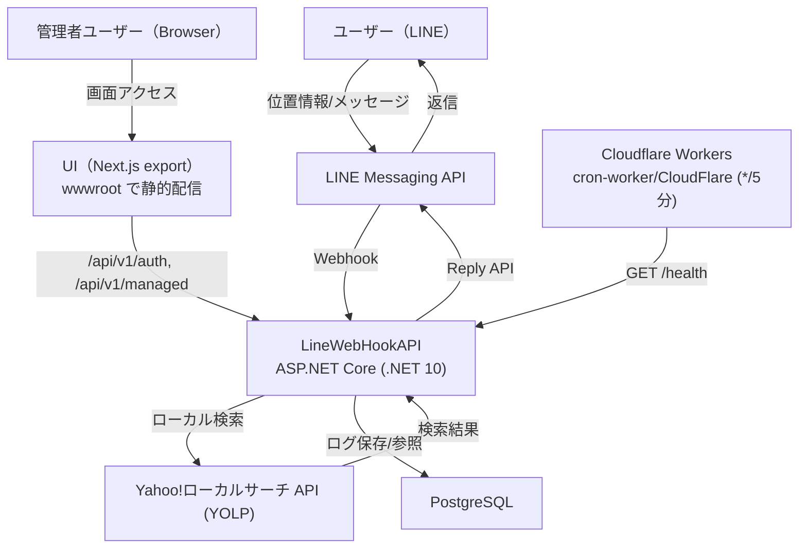
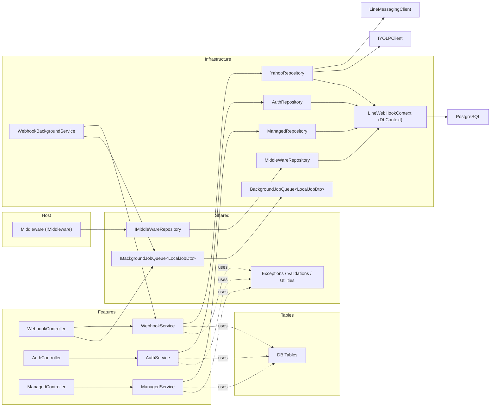
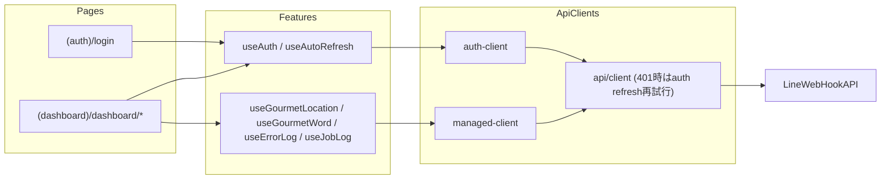
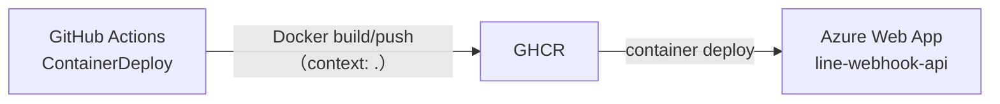

# アーキテクチャ図

## 1. システム全体（Runtime）

## 2. API 内部（Dependency）

## 3. UI 内部（Dependency）

## 4. デプロイ経路（CI/CD）

注記:
- `Dockerfile` は multi-stage build で `UI` をビルドし、`UI/out` を API コンテナの `wwwroot` に同梱します。
- 認証は `Access Token + Refresh Token` を利用し、`RefreshToken` は DB で管理します。
